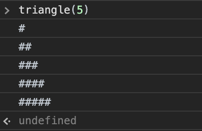
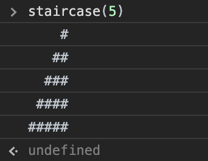
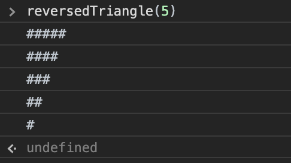
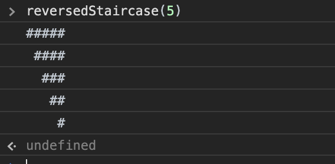

# rightTriangles

<h1 align ='center'><strong>Four Different Positions For a Right Triangle.</strong></h1>
Four different positions for a right triangle with ejs6. 

All these examples uses repeat() to console out a right triangle. 
Repeat() constructs and returns a new string which contains the specified number of copies of the string
on which it is called. 

<h2 align ='center'><strong> Simple Triangle </strong></h2>

const triangle = (n) => {
    for(let i = 1; i<=n ; i++){
        console.log('#'.repeat(i) + ' '.repeat(i))
}}

     

<h2 align ='center'><strong> staircase </strong></h2>

 const staircase = (n) =>{
    for (let i = 1; i<=n; i++){
        console.log(' '.repeat(n-i) + '#'.repeat(i))
}}

     

<h2 align ='center'><strong> reversedTriangle </strong></h2>

 const reversedTriangle = (n) =>{
    for(let i = 0; i< n; i++){
        console.log('#'.repeat(n-i) + ' '.repeat(i))
    }
}

     

<h2 align ='center'><strong> reversedStaircase </strong></h2>

 const reversedStaircase = (n) => {
    for(let i = 0; i< n; i++){
        console.log(' '.repeat(i) + '#'.repeat(n-i))
    }
}

     

